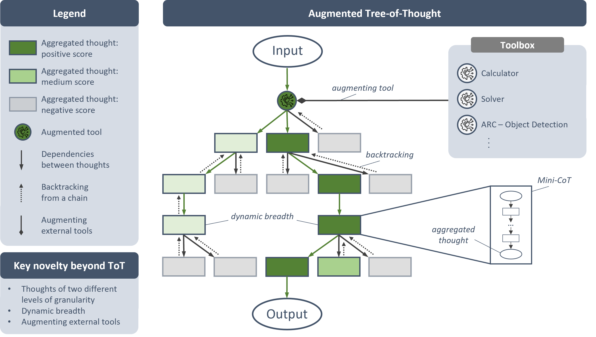

# Augmented Tree-of-Thought

## Description
Large language models (LLMs) have made significant strides in Artificial Intelligence (AI), yet they still face challenges in solving complex reasoning tasks, such as those found in the Abstraction and Reasoning Corpus (ARC). Addressing these challenges is critical to advancing the field of AI and improving generalization capabilities to resemble human reasoning. In the context of ARC, current LLMs struggle with object recognition due to the contrast between the 2D spatial nature of the tasks' pixel grids and the sequential text processing inherent to LLMs. Additionally, the linearity in reasoning caused by conventional prompting strategies, like Chain-of-Thought, restricts performance in ARC tasks. To address these limitations, this paper introduces the Augmented Tree-of-Thought (AToT) framework, an evolution of the Tree-of-Thought approach designed for more complex reasoning tasks, like those found in ARC. AToT enhances effectiveness by incorporating step-specific reasoning strategies throughout a reasoning process and improves efficiency by dynamically adjusting the exploration breadth at each step. The framework also extends the applicability of LLMs to a wider range of task domains by enabling the integration of external tools to overcome inherent limitations that are difficult to address with language modeling alone. For ARC tasks, a basic object detection tool was developed to enhance LLMs' ability to recognize and relate objects in pixel grids. The AToT framework was evaluated through several experiments involving two ARC-like datasets focusing on object-related tasks and a subset of the original ARC benchmark. These experiments revealed significant improvements in LLMs' cognitive flexibility along with higher success rates, particularly in larger-scale models. This suggests that the AToT framework can enhance LLMs' reasoning abilities and enable them to tackle a broader range of reasoning tasks.



More about the original Tree-of-Thought framework can be found [here](https://github.com/princeton-nlp/tree-of-thought-llm).
@misc{yao2023tree,
      title={{Tree of Thoughts}: Deliberate Problem Solving with Large Language Models}, 
      author={Shunyu Yao and Dian Yu and Jeffrey Zhao and Izhak Shafran and Thomas L. Griffiths and Yuan Cao and Karthik Narasimhan},
      year={2023},
      eprint={2305.10601},
      archivePrefix={arXiv},
      primaryClass={cs.CL}
}

The ARC is detailed in [On the Measure of Intelligence by François Chollet (2019)](http://arxiv.org/abs/1911.01547).

## Setup

### Installation Guide
1. Clone the repository.
2. Insert your Huggingface and OpenAI credentials in `./credentials.py` and `tree-of-thought-llm/src/tot/methods/credentials.py`. Ensure these files are listed in `.gitignore`.
3. Create a new python environment: `conda create -n myenv python=3.11`
4. Install required packages from `tree-of-thought-llm/requirements.txt`.

### Running Experiments
1. Modify configurations in `tree-of-thought-llm/src/tot/methods/arc_config.py`:
    - Select GPUs to be used
    - Choose if you want to change the representation from numerical to something else; if you want to test other representations than numerical and you want to use grid representations instead of object representations for ARC tasks, then you might need to adjust the variable DELIMITER to add apostrophes around the tokens used to represent pixels 
    - Add the models you want to test in the MODEL_NAMES and REVISIONS lists
2. Modify configurations in `tree-of-thought-llm/src/tot/prompts/arc_1D.py`:
    - In case you want to use the object detection tool for ARC tasks, change the prompt template accordingly by uncommenting the respective template
3. Modify configurations in `tree-of-thought-llm/run_experiments.py`:
    - `continue_run`: Specify the path to the log directory if you need to continue a terminated run. If not needed, leave this parameter commented.
    - `use_api`: Set to `True` to use the model API, or `False` to use the ChatGPT browser interface by copying prompts from the terminal output.
    - `task`: Choose the dataset to solve:
        - `arc`: A subset of 50 original ARC tasks.
        - `arc_1D`: 1D-ARC tasks.
        - `arc_h_v`: 2D ARC variant with varying object orientations.
    - `input_representation`: Enter `'objects'` to utilize the object detection tool; Otherwise `None`
    - `naive_run`: Set to `True` to run experiments with a naive prompting strategy, or `False` to use AToT.
    - `search_algo`: Select the search algorithm to explore the tree of thoughts.
    - `prompt_sample`: Choose between:
        - `standard`: Standard prompting.
        - `CoT`: Chain of Thought prompts. Using `CoT` with `naive_run=True` implies traditional CoT, while `naive_run=False` implies AToT prompting with Mini-CoTs per reasoning step.
    - `method_generate`: Choose the strategy to sample thoughts:
        - `sample`: Sample one thought per model call.
        - `propose`: Propose multiple thoughts with a single prompt.
    - `method_evaluate`: Select the evaluation strategy:
        - `value`: Use one prompt to assign a value to a single thought.
        - `vote`: Use one prompt to vote over multiple thoughts.
    - `method_select`: Method to select thoughts for further exploration:
        - `sample`: Sample thought based on probability distribution
        - `greedy`: Select best thoughts by value 
    - `revision`: Set to `True` to enable the revision functionality for iteratively revising an abstracted pattern.
    - `n_generate_sample`: Specify the number of thoughts to be sampled at each reasoning step.
    - `n_evaluate_sample`: Set the number of evaluations per thought.
    - `n_select_sample`: Define the number of most-promising thoughts to be explored further.
4. If you want to run only on a subset, change the directory in tree-of-thought-llm/src/tot/data. For the subsets of the 1D-ARC and 2D ARC variants with different object orientations simply switch the names of the directories.
5. After adjustments, reinstall the package: `pip install -e tree-of-thought-llm/.`
6. Run `tree-of-thought-llm/run_experiments.py` and verify your experimental settings in the output prompt before AToT begins solving tasks
7. New results are usually stored in `Testing_none_official_result/`

### Prompt Templates
Prompt templates for a task can be added and adjusted in `tree-of-thought-llm/src/tot/prompts/{task_name}.py`

For ARC tasks, two prompt template files exist, for 1D tasks (`tree-of-thought-llm/src/tot/prompts/arc_1D.py`) and for 2D tasks (`tree-of-thought-llm/src/tot/prompts/arc.py`). 

Regarding the AToT framework, the template should be structured accordingly:
```json
prompt_modules = {
    "0": { // step ID
        "spread": [True, False], // Define whether this tree level should be broadly explored or not
        "phase": ["abstraction", "application"], // Specify the current phase: abstraction or application of transformation
        "generation": {
            "instruct_task": "Instruction about the thoughts to be sampled",
            "output_format": {
                // JSON output format of the model answer
            }
        },
        "evaluation": {
            "instruct_previous_thoughts": "Instruction about what should be evaluated", 
            "instruct_task": "Instruction about how it should be evaluated", // 
            "output_format": {
                // JSON output format of the model answer
            }
        }
    },
    "1": {
        // Additional steps configuration
    }
}
```

### Adding new models
Insert functions to initialize and call the new model in `tree-of-thought-llm/src/tot/models.py`
- `initialize_model()`: define how to load the model and its tokenizer and how to call it. You might want to add a model-specific loading and calling function.
- `prompt_preprocessing_for_model()`: Add model specific prompt structure

## Evaluations of Previous Experiments
The jupyter notebook `result_evaluation.ipynb` contains all relevant analyses of the conducted experiments.

All related log files can be found in `results/`


## Note regarding ARC
All helper functions, including functionality of the object detection tool, can be found in `tree-of-thought-llm/src/tot/methods/arc_utils.py`.